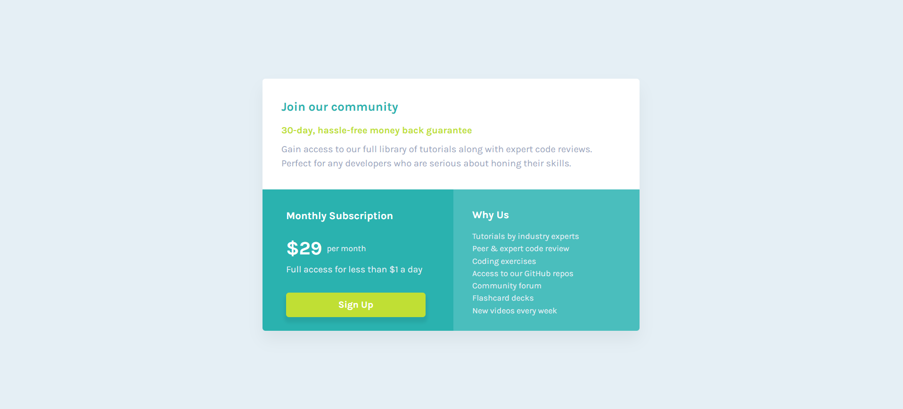

# Frontend Mentor - Single price grid component solution

This is a solution to the [Single price grid component challenge on Frontend Mentor](https://www.frontendmentor.io/challenges/single-price-grid-component-5ce41129d0ff452fec5abbbc).

## Table of contents

- [Overview](#overview)
  - [The challenge](#the-challenge)
  - [Screenshot](#screenshot)
  - [Links](#links)
- [My process](#my-process)
  - [Built with](#built-with)
  - [What I learned](#what-i-learned)
  - [Continued development](#continued-development)
  - [Useful resources](#useful-resources)
- [Author](#author)

---

## Overview

### The challenge

Users should be able to:

- View the optimal layout for the component depending on their device's screen size
- See a hover state on desktop for the **Sign Up** call-to-action

### Screenshot

### Links

- Solution URL: [Add your GitHub repo link here](https://github.com/yourusername/your-repo-name)
- Live Site URL: [Add your live site link here](https://yourusername.github.io/your-repo-name)

---

## My process

### Built with

- Semantic HTML5 markup
- CSS custom properties
- Flexbox
- Mobile-first workflow

### What I learned

- Media queries for layout switching (mobile to desktop)
- Organizing BEM-style class names for better scalability
- Creating accessible HTML with `aria-labelledby`

### Continued development

In future projects, I want to:

- Get more confident using CSS Grid for complex layouts
- Explore accessibility features further (like `aria-*`, focus styles, semantic tags)
- Try utility-first CSS libraries like Tailwind for rapid prototyping

### Useful resources

- [MDN Web Docs](https://developer.mozilla.org/) - Great for CSS and accessibility references.
- [CSS Tricks – Flexbox Guide](https://css-tricks.com/snippets/css/a-guide-to-flexbox/) - A lifesaver when working with Flexbox layouts.
- [Frontend Mentor Slack Community](https://www.frontendmentor.io/slack) - Helpful feedback and motivation.

---

## Author

- Frontend Mentor - [@Esabdul](https://www.frontendmentor.io/profile/Esabdul)
- GitHub - [@Esabdul](https://github.com/Esabdul)
